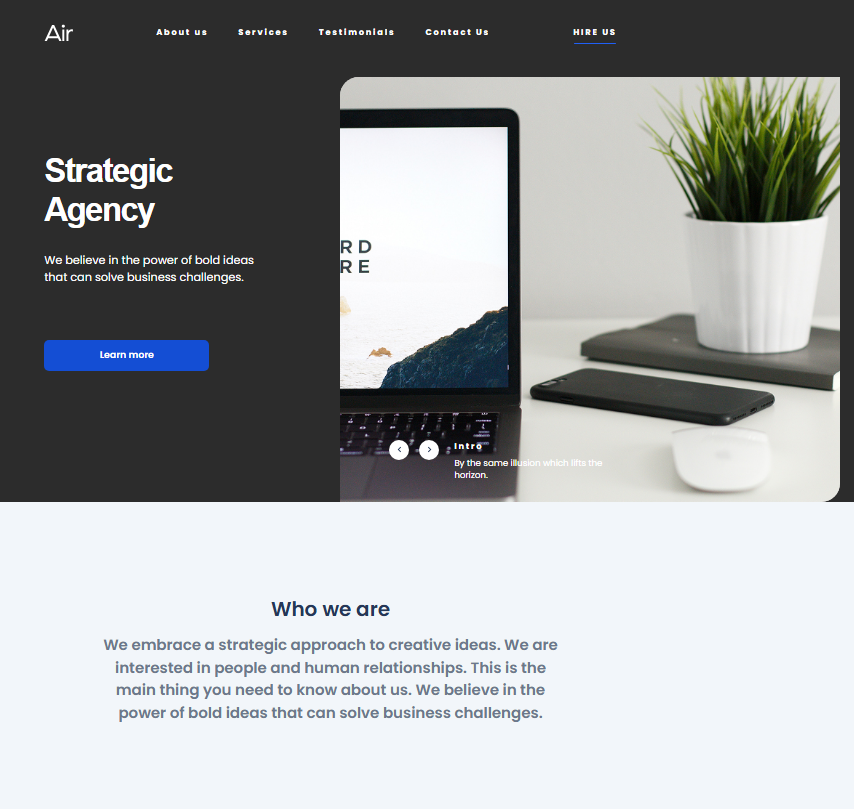

# ✅ Dia Landing Page

A modern, responsive landing page for a strategic agency, implemented according to a Figma design. Built using semantic HTML, SCSS with BEM methodology, and enhanced with smooth scroll, interactivity, and visual polish.

## 🌐 Live Demo

- 🔗 [Live Demo](https://dvdmsk.github.io/Dia/)
- 📎 Fully responsive and pixel-perfect Figma implementation

## 📦 Repository

- 📁 [GitHub Repo](https://github.com/dvdmsk/Dia.git)

## 🛠️ Technologies Used

- **HTML5 + SCSS** — semantic structure and modular styling
- **BEM** — maintainable class naming convention
- **JavaScript (Vanilla)** — interactivity and custom slider/gallery
- **CSS Transitions & Animations** — hover and scroll effects
- **Responsive Design** — adaptive layout across all screen sizes
- **Figma** — source design reference
- **Smooth Scroll** — enhanced navigation UX
- **GitHub Pages** — deployment

## ✨ Features

- 🎯 **Pixel-perfect Figma Design** — 100% design match
- 📱 **Fully Responsive** — adapts to 2560px → 320px screens
- 🧭 **Header with Nav** — anchor links with smooth scroll
- 💡 **Strategic Agency Block** — hero section with call to action
- 🎞️ **Gallery Slider** — image slider using custom JavaScript
- 📌 **Who We Are Section** — company intro
- 🛠️ **Our Expertise** — reusable cards with hover effects
- 🔄 **Process Block** — animated process cards with hover interactions
- 💬 **Testimonials Section** — fixed-width cards switching to column layout on small screens
- 🌈 **Vision, Passion, Results** — with background shapes and scroll-based interaction
- 📬 **Send Us a Message** — functional contact form with validations and clear after submit
- 📍 **Contact Us** — address with Google Maps link
- 🧭 **Footer with Navigation** — links back to sections
- 🧪 **Gallery/Slider** — implemented with JavaScript (optional slider expansion possible)

## 📸 Screenshot



## 🚀 Getting Started

To run the project locally:

1. **Clone the repository**

    ```bash
    git clone https://github.com/dvdmsk/Dia.git
    cd Dia
    ```

2. **Install dependencies and run**

    ```bash
    npm install
    npm start
    ```

3. **Lint and deploy**

    ```bash
    npm run lint
    npm run deploy
    ```

## ✅ UX & Layout Considerations

- Smooth scroll and hover transitions applied throughout
- Scroll-to-section behavior for all nav links and CTAs
- Adaptive layout ensures no horizontal scroll on mobile
- Placeholder hints and validation for form inputs
- Form auto-clears and scrolls after submission (no 405 errors)
- Hover effects added to cards and CTA buttons
- Google Maps opens in new tab on address click
- Gallery section optimized for performance (responsive)

## 🤝 Contributing

Found a bug or have a suggestion?
Feel free to open an issue or contribute via PR!

## 📬 Contact Me

- 💬 Telegram: [@dvd5678](https://t.me/dvd5678)
- 📧 Email: [dvdmsk21@gmail.com](mailto:dvdmsk21@gmail.com)
- 💼 LinkedIn: [David Moskalenko](https://www.linkedin.com/in/david-moskalenko-0a68051b8)
